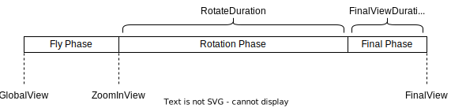
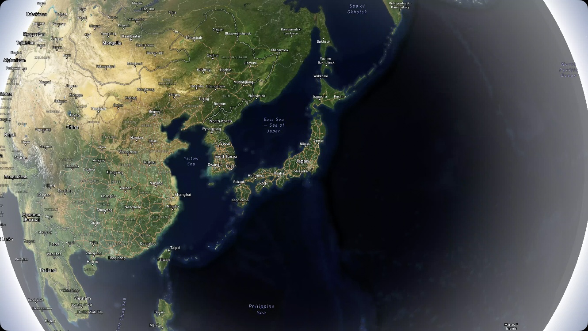
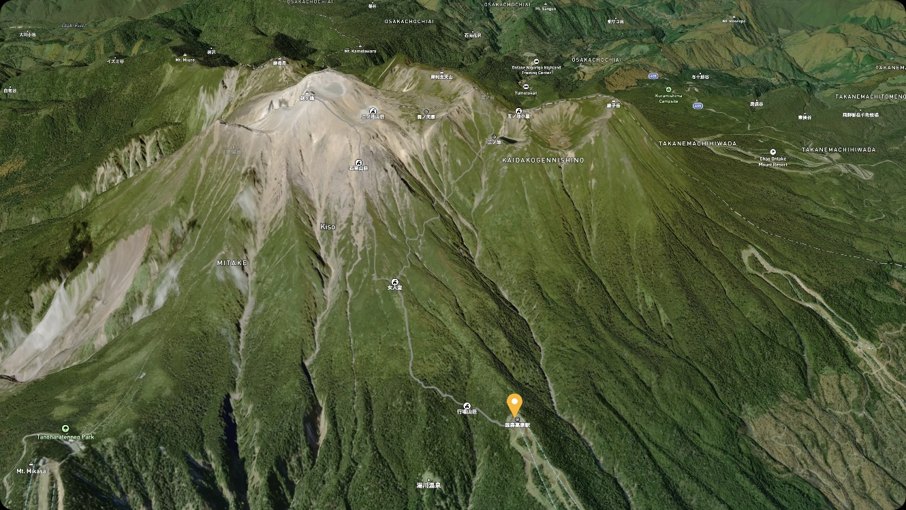
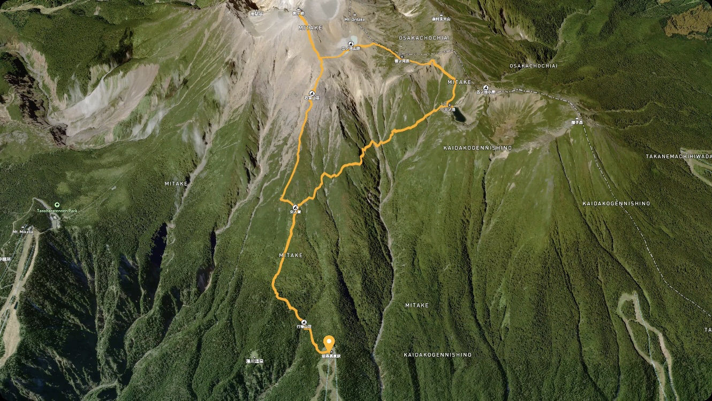
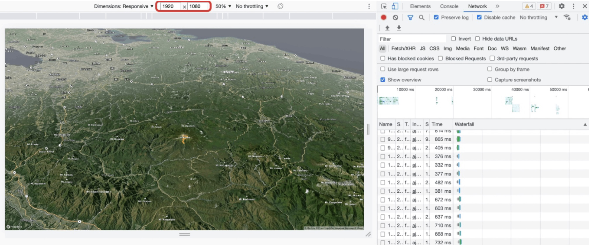

# Route animation
## Demo 
[The hiking video from my YouTube channel](https://www.youtube.com/clip/UgkxPGQaaczd3gCTJHsUVAuFQrDt_RDpqWXF)


## About animation
### Phases
Animation consists of three phases.



1. Fly Phase: Zoom into ZoomInView from GlobalView.
2. Rotation Phase: Route animation while the camera rotates.
3. Final Phase: Move to FinalView which show the whole route.

### Key frames
| GlobalView | ZoomInView | FinalView |
|------------|------------|-----------|
|  |  | |

## How To Use
### 1. Mapbox access token
Please set your Mapbox access token in `src/config.js`.
```
accessToken: "xxx",  // Please set your Mapbox access token.
```

### 2. Run
Run http server and Load index.html
- Reference: HTTP Server with VSCode Extention, [local live server](https://marketplace.visualstudio.com/items?itemName=ritwickdey.LiveServer).

## Customize
### Preparation
To prevent the creation of an mp4 file each time an animation is played, turn off the mp4 file creation feature during the customization process. Please set the value of `record` in `src/config.js` to `false`.

```
record: false,        // If true, mp4 file will be created.
```

### Resolution
The resolution of the animation depends on the resolution of your browser. To change the resolution, adjust the browser window size. If you want to specify the resolution value explicitly, use the developer tools to enter the resolution value manually.


### Camera angle & animation speed
You can use `src/config.js` to adjust the camera angle of KeyFreme and the animation speed of each Phase.
Change the values to find the animation you prefer.

```
videoSpeed: {...},   // Vide speed settings.
zoomInView: {...},   // ZoomInView's settings.
rotation: {...},     // Rotation settings.
finalView: {...},    // Final view's settings.
style: {...},        // Style settings.
```

### Data
In this repository, I created an animation of a hiking route as an example, but as long as you have trajectory data, you can create an animation. If you are recording activities such as running, walking, cycling, skiing, etc, please try to create an animation with your own data.

```
data: {...},         // Please set your geojson files.
```

## References
- [impact-tools](https://github.com/mapbox/impact-tools/tree/master/journey-animation-sequence)
- [Query terrain elevation](https://docs.mapbox.com/mapbox-gl-js/example/query-terrain-elevation/)
- [BUILDING CINEMATIC ROUTE ANIMATIONS WITH MAPBOXGL](https://www.mapbox.com/blog/building-cinematic-route-animations-with-mapboxgl)
- [Mapbox GL JSでルートアニメーションを作る🌏🎥(Japanese)](https://zenn.dev/yukinakanaka/articles/2c0b93366d27e1)